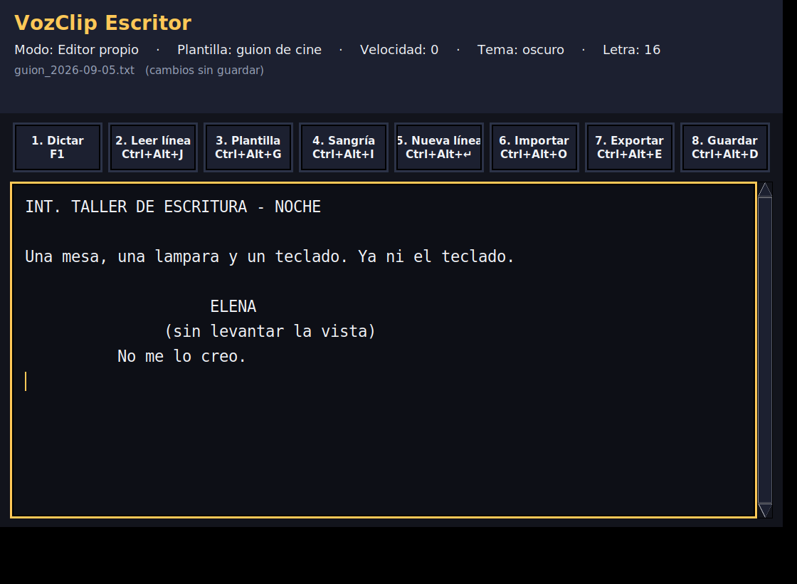
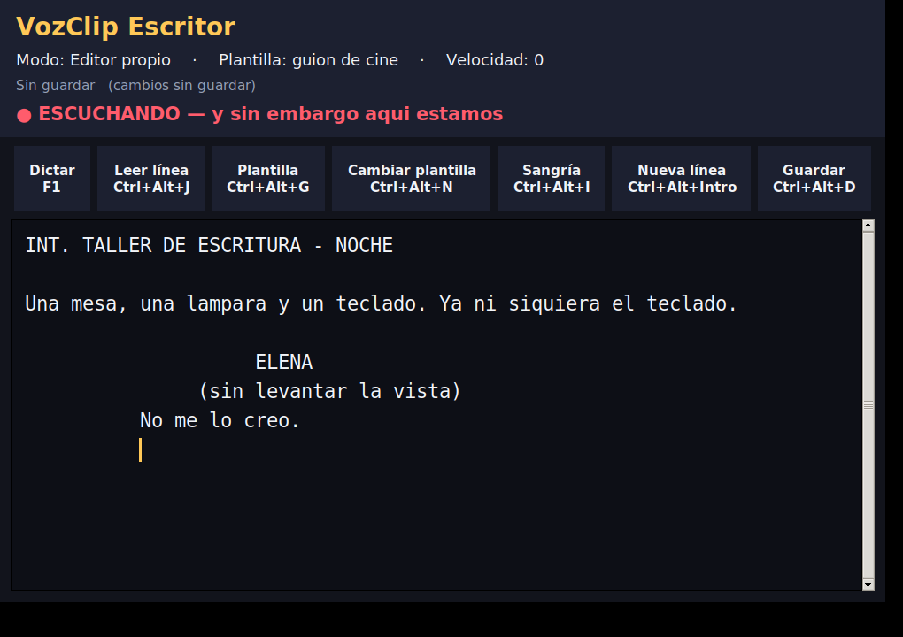
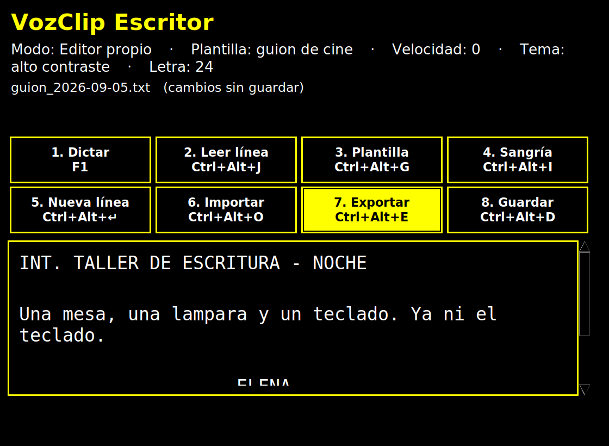

# VozClip Escritor

Editor de guiones que habla, para escritores sin visión.

Ventana con estado siempre visible, plantillas de guion con sangrías
correctas, atajos globales de teclado y confirmación por voz de **todas** las
acciones. Windows como objetivo principal; funciona también en Linux y macOS.



---

## Qué resuelve

Un escritor ciego necesita tres cosas que un procesador de textos normal no
le da bien:

1. **Saber dónde está** sin mirar. Aquí, al moverse con las flechas se
   anuncia el número de línea y su contenido; `Ctrl+Alt+W` resume modo,
   plantilla, archivo y posición.
2. **Sangrías correctas sin verlas.** El formato de guion cinematográfico
   tiene márgenes concretos que las productoras esperan. Las plantillas los
   ponen solas.
3. **Confirmación de cada acción.** Si pulsas algo y no oyes nada, no sabes
   si ha funcionado. Aquí todo se dice.

---

## Atajos

### Dictar
| Atajo | Acción |
|---|---|
| `F1` | Empezar o parar el dictado por voz |

Pulsa `F1`, espera el pitido, habla, y pulsa `F1` otra vez. El texto aparece
donde esté el cursor.



Mientras dictas puedes decir los signos: *coma*, *punto*, *punto y aparte*,
*punto y coma*, *dos puntos*, *raya*, *abre paréntesis*, *cierra paréntesis*,
*abrir interrogación*, *cerrar interrogación*, *abrir exclamación*,
*cerrar exclamación*, *comillas*, *puntos suspensivos*, *nueva línea*.

> «raya no me lo creo punto» → `—No me lo creo.`

Si dictas dentro de una plantilla, se respeta la sangría: un *punto y aparte*
en mitad de un diálogo de cine deja la línea nueva alineada con las demás.

**La primera vez hay que instalar el modelo de voz** (39 MB, una sola vez).
Desde el menú Inicio, en *Instalar el dictado por voz*, o con
`VozClip-Diagnostico.exe --instalar-modelo-dictado`. Después funciona sin
internet para siempre.

### Corregir por voz
| Atajo | Acción |
|---|---|
| `F9` | Corregir una palabra: pulsa, di el cambio, pulsa |
| `Esc` | Cancelar la corrección |

El reconocimiento se equivoca en una palabra y repetir todo el párrafo es
lento; corregirlo a mano sin ver la pantalla, casi imposible. Aquí se
corrige **diciendo el cambio**:

> F9 → «cambia casa por cosa» → F9 → «He cambiado casa por cosa.»

**Y también con F1.** La primera captura real de Julián lo dejó claro: dictó,
oyó una palabra mal, y volvió a pulsar la misma tecla para decir «alpiste
por rueda». Ahora, si lo dictado con F1 empieza por *cambia*, *sustituye*,
*corrige* o *borra* y la palabra está en el párrafo, se aplica como
corrección y no se escribe. Sin el verbo se escribe tal cual: «fue por
pan» también parecería una orden si «fue» estuviera en el texto.

Solo se toca esa palabra: sangrías, puntuación pegada y mayúscula inicial
se conservan. También «cambia no me lo creo por no lo creo» (frases),
«borra además», «cancela», «deshacer». Si la palabra mal reconocida es
irreconocible, «léelo» enumera el párrafo («1, aquella. 2, noche…») y se
corrige por número: «la tres por cosa», «de la tres a la cinco por…». Si
aparece varias veces, pregunta cuál. Actúa sobre el párrafo del cursor; en
modo externo, sobre la línea.

**Dos modos**, en `correccion.modo` del `config.json`:

| | `"directo"` (por defecto) | `"numerado"` |
|---|---|---|
| F9 | «Dime el cambio» | Lee el párrafo numerado y pregunta cuál |
| Escuchas | 1 | 3: número → confirma la palabra → dicta la nueva |
| Hay que pronunciar la palabra mal reconocida | sí | no |

El directo es el predeterminado porque leer treinta palabras con su número
tarda el doble que el texto. Pero desde el directo, «léelo» entra en el
guiado, así que las dos formas están siempre a mano.

**La versión se oye.** El saludo dice «VozClip Escritor dos punto diez en
marcha»; `Ctrl+Alt+W` la repite; `--version` la imprime; el título de la
ventana la lleva. Sin eso no hay forma de saber, sin ver la pantalla, si
un arreglo ha llegado al ordenador o se sigue ejecutando una versión
antigua.

Quien prefiera el flujo guiado siempre lo tiene: `"correccion": {"modo":
"numerado"}` hace que F9 numere el párrafo, pregunte cuál, lea la palabra
elegida y pida la nueva. Tres escuchas en vez de una, pero nunca hay que
pronunciar la palabra que salió mal.

**La versión se oye.** El saludo dice «VozClip Escritor dos punto diez en
marcha», y `Ctrl+Alt+W` la repite. Es la única forma de saber, sin ver la
pantalla, si un arreglo ha llegado al ordenador o se sigue ejecutando una
versión antigua. `vozclip --version` la imprime.

### Escribir
| Atajo | Acción |
|---|---|
| `Ctrl+Alt+G` | Insertar la plantilla de guion activa |
| `Ctrl+Alt+N` | Cambiar de plantilla (teatro → cine → narrativo → escaleta) |
| `Ctrl+Alt+T` | Saltar al siguiente hueco de la plantilla |
| `Ctrl+Alt+I` | Aplicar sangría de párrafo |
| `Ctrl+Alt+U` | Quitar sangría |
| `Ctrl+Alt+Intro` | Nueva línea heredando la sangría |
| `Ctrl+Alt+D` | Guardar |

### Archivos
| Atajo | Acción |
|---|---|
| `Ctrl+Alt+O` | Importar: abrir un archivo (.txt, .md, .rtf, .docx) |
| `Ctrl+Alt+E` | Exportar todo |
| `Ctrl+Alt+S` | Guardar como |

Importar **conserva las sangrías tal cual**. Es la diferencia entre
`leer_para_editor` y el camino de la voz, que sí normaliza el texto para
decirlo de corrido: usar el segundo para importar destrozaría los márgenes
de un guion, y quien no los ve no puede arreglarlos.

Exportar copia todo al portapapeles en el editor propio, o lo escribe
directamente en la aplicación activa si estás en modo externo.

### Escuchar
| Atajo | Acción |
|---|---|
| `Ctrl+Alt+J` | Leer la línea actual |
| `Ctrl+Alt+K` | Leer lo seleccionado |
| `Ctrl+Alt+L` | Leer el portapapeles |
| `Ctrl+Alt+A` | Leer el documento entero |
| `Ctrl+Alt+P` | Pausar o reanudar |
| `Ctrl+Alt+X` | Parar |

### Ver mejor
| Atajo | Acción |
|---|---|
| `Ctrl+Alt+C` | Cambiar de tema: oscuro → alto contraste → claro |
| `Ctrl+Alt++` | Letra más grande (hasta 42 puntos) |
| `Ctrl+Alt+-` | Letra más pequeña |
| `Ctrl+Alt+Z` | Modo solo voz: ventana mínima |



### Moverse
| Atajo | Acción |
|---|---|
| `Tab` | De un botón al siguiente |
| `F6` | Saltar entre el editor y los botones |
| `Alt+1` … `Alt+8` | Pulsar ese botón directamente |
| `↑` `↓` | Mover el cursor y oír la línea nueva |

### Ajustar
| Atajo | Acción |
|---|---|
| `Ctrl+Alt+↑` / `↓` | Velocidad de la voz |
| `Ctrl+Alt+V` | Cambiar de voz |
| `Ctrl+Alt+M` | Alternar editor propio / aplicación externa |
| `Ctrl+Alt+W` | Dónde estoy |
| `Ctrl+Alt+H` | Escuchar la lista de atajos |
| `Ctrl+Alt+Q` | Salir (guarda antes) |

Se usa `Ctrl+Alt` a propósito: NVDA y JAWS reservan `Insert` y `Bloq Mayús`.

---

## Los dos modos

**Editor propio** (recomendado). Se escribe dentro de VozClip. Todo funciona
de forma fiable porque el programa controla el texto.

**Aplicación externa** (`Ctrl+Alt+M`). Las plantillas se pegan en Word,
LibreOffice o lo que tengas delante, vía portapapeles y `Ctrl+V`. Es
inevitablemente más frágil: depende de que la otra aplicación responda a
tiempo. Útil cuando hay que trabajar sobre un documento que ya existe.

---

## Plantillas

| Clave | Formato |
|---|---|
| `teatro` | Acto, escena, acotación entre paréntesis, personaje al margen y diálogo sangrado |
| `cine` | Encabezado de escena, acción, personaje a 20 espacios, acotación a 15, diálogo a 10 |
| `narrativo` | Diálogo con raya y verbo dicendi, norma española |
| `escaleta` | Bloque de planificación: lugar, personajes, qué ocurre, qué cambia |

Cada plantilla lleva marcas `|` donde hay que escribir. Al insertarla, el
cursor va al primer hueco y `Ctrl+Alt+T` salta al siguiente. Se pueden
añadir plantillas nuevas editando `src/vozclip/plantillas.py`.

---

## Descargar VozClip

La última versión está siempre en la misma dirección:

**https://github.com/Gisleno-bit/vozclip/releases/latest/download/VozClip-Windows.zip**

Descomprime y haz doble clic en `VozClip.exe`. No abre consola, saluda por
voz y dice su versión («VozClip Escritor dos punto once en marcha»). No
hace falta Python ni instalar nada: el modelo de voz va dentro.

En la [página de releases](https://github.com/Gisleno-bit/vozclip/releases/latest)
está también `VozClip-Instalador.exe`, que crea el acceso directo en el
escritorio sin pedir permisos de administrador, y los dos ejecutables
sueltos.

### Si algo falla

`VozClip-Diagnostico.exe` dice por voz y por pantalla qué falta. Cada
arranque deja además un registro en `%APPDATA%\VozClip\ultimo_arranque.log`.

### Cómo se genera esa descarga

Sola. Cada push a `main` compila en GitHub Actions (`release.yml`), verifica
el ejecutable con `--autotest`, arma el ZIP y publica la release
`v<versión>` leyendo la versión de `pyproject.toml`. Nadie etiqueta nada.

Como los archivos que empiezan por punto no llegan con la subida a mano,
**`SUBIR_A_GITHUB.html`** (en la raíz del proyecto) tiene un botón por cada
workflow que abre GitHub con el contenido ya escrito: solo hay que pulsar
«Commit changes». Se regenera con `python scripts/enlaces_github.py`.

## Desde el código fuente, con un doble clic

Descomprime el ZIP y haz doble clic en **`INSTALAR.bat`**. Busca Python (y
lo instala con winget si no está), crea un entorno propio en `.venv`,
instala las librerías, descarga el modelo de voz y deja un acceso directo
"VozClip" en el escritorio. Lo va contando en voz alta y pita al terminar.
Si algo falla a medias, vuelve a hacer doble clic: lo hecho no se repite.

Después, `Iniciar VozClip.bat` o el acceso directo abren el programa sin
consola.

## Desde el código fuente, a mano

```bash
git clone https://github.com/Gisleno-bit/vozclip.git
cd vozclip

python -m venv .venv
.venv\Scripts\activate          # Linux/macOS: source .venv/bin/activate

pip install -r requirements-dev.txt
pip install -e .

vozclip --diagnostico            # primero, comprobar el entorno
vozclip                          # abrir el programa
vozclip guion.txt                # abrirlo con un archivo cargado
```

---

## Configuración

`%APPDATA%\VozClip\config.json`, texto plano editable con el Bloc de notas:

```json
{
  "voz": "Microsoft Helena Desktop",
  "velocidad": 2,
  "plantilla": "cine",
  "modo": "editor",
  "carpeta_guiones": "",
  "tamano_fuente": 18,
  "atajos": { "guardar": "ctrl+alt+d" }
}
```

Los atajos admiten tanto `ctrl+alt+d` como `<ctrl>+<alt>+d`. Si el archivo se
corrompe, el programa arranca con los valores por defecto en vez de fallar:
para alguien que no ve la pantalla, arrancar siempre importa más que avisar
de un error de sintaxis.

---

## Decisiones de accesibilidad

**Tres temas, no uno.** El oscuro emite poca luz y es el que menos cansa en
sesiones largas. El de alto contraste usa negro y amarillo puros, la relación
de contraste máxima que se puede conseguir (21:1); el amarillo se prefiere al
blanco porque se distingue mejor en varios tipos de baja visión. El claro
está para quien lo prefiera o trabaje con mucha luz ambiente.

**Los rótulos de la interfaz se topan en 22 puntos** aunque el texto del guion
llegue a 42. Sin ese tope, los ocho botones acababan ocupando la ventana
entera y empujando al editor fuera de la pantalla. Quien sube la letra quiere
leer mejor el guion, no ver botones gigantes. Por lo mismo, la botonera se
reparte en dos filas de cuatro cuando la letra crece, en vez de recortar los
rótulos.

**El cursor no parpadea** (`insertofftime=0`). Un elemento moviéndose de forma
permanente en la pantalla cansa a quien tiene fatiga visual. Se puede
reactivar en el `config.json`.

**Nada parpadea ni cambia de color solo.** No hay animaciones, ni avisos que
destellen, ni colores saturados en superficies grandes.

**Cada acción se confirma por voz**, y al llegar a un botón con el tabulador,
el botón se presenta solo con su nombre y su atajo.

**El título de la ventana refleja el estado** (archivo, si hay cambios sin
guardar, y modo). Es lo único que un lector de pantalla externo lee bien de
una ventana de tkinter, así que se aprovecha.

## Portabilidad entre editores

El modo externo escribe en cualquier programa mediante el portapapeles y
`Ctrl+V`, que es la única técnica que funciona en todas partes. Los tres
problemas reales y su solución:

**Cada programa tarda lo suyo.** El Bloc de notas pega al instante; Word
tarda tres veces más; Google Docs en el navegador, aún más, porque el pegado
pasa por JavaScript. Una espera fija o va sobrada o se queda corta, así que
se **adapta**: se parte de un valor por aplicación y se ajusta según lo que
tardó la vez anterior — sube deprisa al fallar, baja despacio al acertar.

**No siempre se puede saber si funcionó.** Al copiar sí: se deja una marca
en el portapapeles y se comprueba si cambió. Al pegar no hay forma universal,
así que se reintenta con más margen y, donde el pegado no está permitido, se
teclea.

**El portapapeles es del usuario.** Lo que tuviera copiado se guarda antes y
se restaura después, siempre, incluso si algo falla por el camino.

| Programa | Insertar | Capturar | Notas |
|---|---|---|---|
| Bloc de notas, WordPad | sí | sí | |
| Notepad++, VS Code | sí | sí | |
| Microsoft Word | sí | sí | Más lento; la espera se ajusta sola |
| LibreOffice Writer | sí | sí | |
| Outlook | sí | sí | En el cuerpo del mensaje |
| Google Docs (navegador) | sí | sí | El pegado pasa por JavaScript |
| Excel / Calc | sí | sí | Los saltos de línea cambian de celda |
| Terminal / PowerShell | sí (tecleando) | no | `Ctrl+V` no siempre pega ahí |
| PDF protegidos | no | no | Sin permiso de copia no hay nada que hacer |

## Por qué Vosk para el dictado

| Motor | Offline | Peso | Latencia | Veredicto |
|---|---|---|---|---|
| **Vosk** | Sí | 7 MB librería + 39 MB modelo | Tiempo real | **Elegido** |
| Whisper | Sí | Cientos de MB (PyTorch) | Segundos por frase | Demasiado pesado y lento |
| Google Web Speech | No | Ligero | Buena, si hay red | Depender de internet para escribir es inaceptable |
| SAPI de Windows | Sí | Ya instalado | Buena | Exige un paquete de idioma que no viene por defecto |

Lo que aquí no se negocia es que funcione siempre. El día que se caiga la
conexión, tu amigo tiene que poder seguir trabajando. Vosk reconoce en
tiempo real con un núcleo de CPU y sin red, y el `.exe` solo crece de 26 a
36 MB.

Cambiar de motor es escribir una clase nueva en `dictado.py` que cumpla el
protocolo `MotorReconocimiento` (`iniciar`, `alimentar`, `finalizar`,
`cerrar`). El resto del programa no se entera.

## Dictado con Whisper (opcional)

Vosk viene incluido y funciona sin instalar nada. Para la máxima precisión
—nombres propios, frases largas, acentos— VozClip admite **faster-whisper**,
la implementación de Whisper sobre CTranslate2. Como VozClip es Python, se
integra directamente: no hacen falta procesos de Electron ni IPC.

Hay dos formas de usarlo, y una tabla para elegir:

| | `"motor": "whisper"` | `"motor": "whisper-servidor"` |
|---|---|---|
| Dónde corre el modelo | dentro de VozClip | proceso aparte, siempre caliente |
| Primer F1 tras arrancar | espera la carga (segundos a medio minuto) | instantáneo |
| Memoria en el proceso de la ventana | la del modelo (hasta 3 GB) | nada |
| Necesita Python instalado | sí | sí, pero VozClip puede ser el `.exe` |
| Para | `small` en CPU | `large-v3` con GPU |

### Instalación

```bash
pip install -r requirements-whisper.txt
```

Con **GPU NVIDIA**, además:

```bash
pip install nvidia-cublas-cu12 nvidia-cudnn-cu12
```

En Windows, las DLL quedan en `site-packages\nvidia\cublas\bin` y
`site-packages\nvidia\cudnn\bin`; si CTranslate2 no las encuentra, añade
esas carpetas al PATH. VozClip detecta la GPU solo: con `"auto"` elige
`large-v3` en `float16` si hay CUDA, y `small` en `int8` si no.

### Modo servidor (recomendado con GPU)

Doble clic en `scripts\iniciar_servidor_whisper.bat`. Instala lo que falte,
carga el modelo una vez (la primera descarga `large-v3`, 3 GB) y se queda
escuchando en `http://127.0.0.1:8765`. Deja la ventana abierta.

En `config.json`:

```json
"dictado": { "motor": "whisper-servidor" }
```

VozClip comprueba el servidor al pulsar F1. Si no responde, lo dice en voz
alta y sigue con Vosk: una opción que falta no deja el dictado mudo.

El servidor es `scripts/servidor_whisper.py`, biblioteca estándar, sin
dependencias de red, y solo escucha en `127.0.0.1`. Protocolo:

```
GET  /salud        → {"ok": true, "modelo": "large-v3", "dispositivo": "cuda"}
POST /transcribir  → cuerpo: WAV mono 16 kHz · respuesta: {"texto": "...", "segundos": 1.8}
```

### Modo integrado

```json
"dictado": { "motor": "whisper", "whisper_modelo": "small" }
```

Más simple, sin ventana aparte, para `small` o `base` en CPU.

### Lo que cambia respecto a Vosk

Whisper **no es streaming**: transcribe el audio completo al pulsar F1. No
hay parciales en pantalla mientras dictas. Con `small` en CPU, 10 s de
audio tardan 3–6 s; con `large-v3` en GPU, 1–2 s. Se descartan grabaciones
de menos de medio segundo (el clic de la tecla) porque Whisper alucina con
ellas, y `condition_on_previous_text=False` evita los bucles de repetición.

### Captura de audio

Con cualquier motor, la captura ahora mide el nivel de la señal: si grabas
silencio, VozClip distingue "no he entendido" de "el micrófono está mudo o
en otro dispositivo", que son dos problemas con dos soluciones. Y si el
equipo va justo y pierde bloques de audio, lo dice en vez de recortar
palabras en silencio.

## Arquitectura

```
src/vozclip/
├── voz.py         ServicioVoz: UN hilo dueño del motor, órdenes por cola
├── dictado.py     Reconocimiento de voz, captura de audio y puntuación hablada
├── modelo.py      Descarga del modelo de voz, una sola vez
├── hud.py         La ventana de tkinter y todas las acciones
├── documento.py   Operaciones de edición como funciones puras (testables)
├── plantillas.py  Catálogo de formatos de guion
├── atajos.py      Atajos globales: solo encolan, nunca ejecutan
├── puente.py      Pegar y capturar en la aplicación externa, con espera adaptativa
├── fuentes.py     Portapapeles, importación (txt/md/rtf/docx) y guardado atómico
├── texto.py       Limpieza y troceado antes de hablar
├── config.py      Ajustes en JSON
└── cli.py         Arranque, diagnóstico y registro
```

**Cuatro hilos, y cada uno en su sitio.** El principal dibuja la ventana. El
de `pynput` escucha el teclado y solo mete nombres de acción en una cola. El
de `ServicioVoz` es el único que toca el motor de voz. El de `ServicioDictado`
graba y reconoce, y avisa por otra cola. Ningún hilo cruza a otro, que es
exactamente el error que dejaba mudo el programa en la versión 1.

---

## Tests

```bash
pytest -q                            # Windows
xvfb-run -a pytest -q                # Linux (los tests del HUD abren ventana)
xvfb-run -a python pruebas_manuales/humo.py   # extremo a extremo
python -m vozclip --autotest         # verifica este binario o este código
```

297 tests. 79 levantan una ventana de tkinter real; 26 vigilan la
configuración de empaquetado; 46 cubren el dictado; 23 el puente con
aplicaciones externas; 24 la importación y exportación.

Si Tcl/Tk no funciona en la máquina (pasa de forma intermitente en algunos
runners de Windows), los tests del HUD se saltan solos con su motivo en vez
de teñir la CI de rojo. Si Tcl/Tk no funciona en la máquina (pasa en
algunos runners de Windows), los 31 del HUD se saltan solos con su motivo
en vez de teñir la CI de rojo.

---

## Limitaciones conocidas

- **El dictado necesita descargar el modelo la primera vez** (39 MB). Es la
  única vez que hace falta internet; después funciona siempre sin red.
- **La precisión del modelo pequeño es razonable, no perfecta.** Para
  nombres propios y jerga conviene repasar. Existe un modelo grande de
  1,4 GB bastante mejor: se puede poner su ruta en `dictado.modelo` del
  `config.json`.
- **`F1` va sin modificadores a propósito**, porque es el atajo que más se
  usa y tiene que ser de una sola tecla. Como el escuchador no suprime la
  pulsación, en otras aplicaciones `F1` seguirá abriendo su ayuda además de
  activar el dictado. Si molesta, en el `config.json` se puede cambiar a
  `ctrl+alt+f1`.
- **Tkinter no se expone bien a NVDA.** Tk no implementa UI Automation como
  es debido, así que un lector de pantalla externo lee mal esta ventana. Por
  eso VozClip habla por sí mismo todo. Si tu amigo prefiere que sea NVDA
  quien lo lea todo, la alternativa es escribir en Word con NVDA y usar
  VozClip solo en modo externo para las plantillas.
- El modo externo depende de simular `Ctrl+V` y `Ctrl+C`. En aplicaciones
  lentas puede hacer falta subir `ESPERA_PEGADO` en `puente.py`.
- Cada acción de edición reemplaza el contenido completo del widget para que
  `documento.py` sea la única fuente de verdad. Es instantáneo en guiones
  (decenas de miles de caracteres); en documentos de megabytes no lo sería.
- Los atajos globales pueden chocar con otro programa que ya los tenga
  cogidos. Se cambian en el `config.json`.
- PyInstaller genera ejecutables sin firmar que Windows Defender marca a
  veces como sospechosos. Puede hacer falta una excepción.

---

## Licencia

MIT. Ver [LICENSE](LICENSE).
